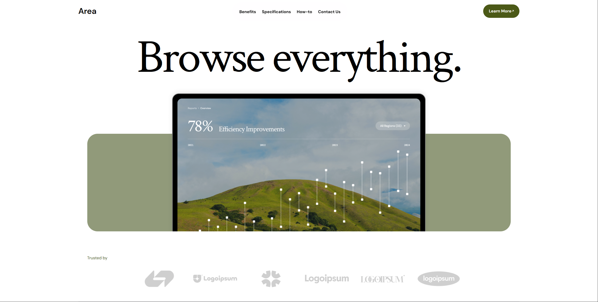
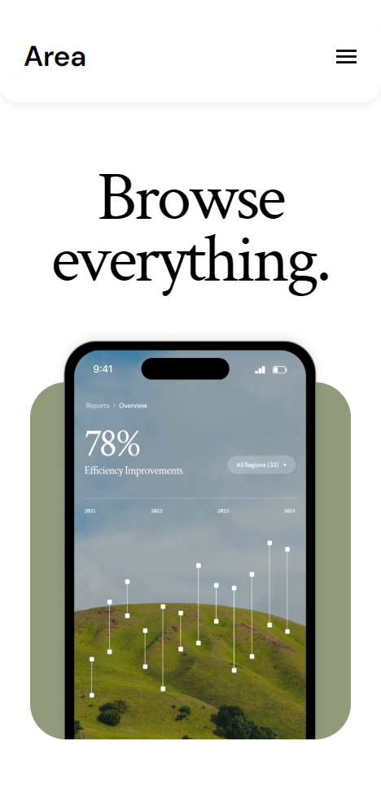

# browse-everything-frontend
Website created by following a figma design, the technologies that were used are html / css / js. Website used semantic html and responsive css at 3 different sizes. Some JS was used to toggle mobile nav and to activate the reveal class as elements are shown in the viewport  

## Live Demo

## Screenshots
- Desktop Design

- Mobile Design

## Features

- Fully Responsive design
- Hamburger Menu toggle for mobile
- Clean modern design following figma template

## Technologies Used

- HTML5
- CSS3
- JavaScript